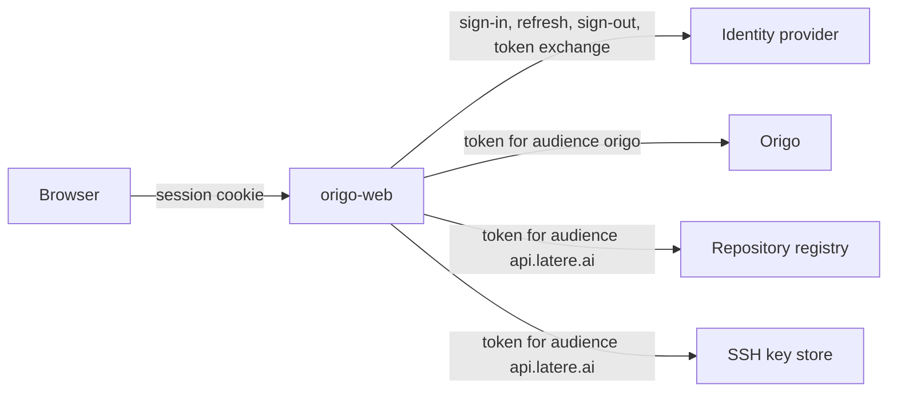

# Integrations

For whoever connects origo-web to an identity provider, a repository
registry, and an SSH key store. It lists every call the interface makes
outside itself and what each must answer.

origo-web holds no credential of its own. A person signs in at the identity
provider; the interface keeps that session in an encrypted cookie, and for
each service it calls it asks the provider for a short-lived token addressed
to that service alone. So every call acts with the signed-in person's own
authority, and the interface can do nothing that person could not do with
`curl`.



The registry and the key store are optional. The identity provider and
Origo are not.

## The identity provider

The interface builds each endpoint from `ORIGOWEB_AUTH_URL` by appending a
fixed path. It does not read the provider's discovery document, so the
provider serves these paths under that base:

| Call | What it must do |
|---|---|
| `GET /authorize` | the authorization code flow with PKCE (`S256`), carrying `state`, `nonce`, the redirect URI, and the scopes of `ORIGOWEB_AUTH_SCOPES` |
| `POST /token` | exchange the code, and refresh the session with a refresh token. A confidential client authenticates with HTTP Basic; a public client sends its `client_id` in the body |
| `GET /.well-known/jwks.json` | the keys an ID token is verified against, when the token response carries one. Its `nonce` must match the sign-in's |
| `POST /actor-tokens` | the token exchange described below |
| `GET /logout?post_logout_redirect_uri=…` | end the provider's session and return the browser to that address |
| `GET /me` | the page where a person claims the name their repositories live under. It is only linked, from **New repository**, when the registry says the person holds no name |

The access token the provider issues at sign-in must be a JWT. Its claims
name the person on every page: the display name, the name, the email
address, or the subject, whichever comes first.

### The token exchange

Every call to Origo, to the registry, and to the key store carries a token
the provider minted for that one audience, never the session token itself.
The interface asks for one per session and audience, reuses it until 30
seconds before it expires, and then asks again:

```
POST <ORIGOWEB_AUTH_URL>/actor-tokens
Authorization: Bearer <the session's access token>
Content-Type: application/json

{"audience": "origo", "ttl_seconds": 300}

200 {"actor_token": "<jwt>", "expires_in": 300}
```

Any status outside 2xx is a refusal, and the provider refuses an audience
this client is not registered to act at. The interface asks for two
audiences, and both are fixed in this build:

| Audience | Carried to |
|---|---|
| `origo` | Origo, which verifies it against `ORIGO_OIDC_AUDIENCE`. That is Origo's default, so an installation that changed it keeps `origo` in the list |
| `api.latere.ai` | the repository registry and the SSH key store |

When the provider will not mint one of them, the person stays signed in,
and the screens that need that token say the identity provider did not
answer. Screens that need only the other token keep working.

### Registering the client

Register one client for the interface, for the browser flow:

| Setting | Value |
|---|---|
| Redirect URI | `<ORIGOWEB_PUBLIC_URL>/auth/callback`, or `ORIGOWEB_AUTH_REDIRECT_URL` when set |
| Post-logout redirect URI | `<ORIGOWEB_PUBLIC_URL>/sign-in` |
| Front-channel logout URI | `<ORIGOWEB_PUBLIC_URL>/logout/notify` |
| Scopes | `openid`, `email`, `profile`, and `offline_access` for a refresh token |
| Actor-token audiences | `origo`, and `api.latere.ai` when a registry or a key store is in use |

The provider must also be one of Origo's `ORIGO_OIDC_ISSUERS`, or Origo
refuses every token the interface forwards.

**Front-channel logout.** When the person signs out somewhere else, the
provider loads `/logout/notify` in a hidden frame and the session here ends.
That address is the only one the interface lets be framed, and only by the
provider's origin. Two conditions make it work: the URI above is registered,
and the provider is on the same site as the interface, because the session
cookie is `SameSite=Lax` and a browser does not send it across sites.
Without either, a session here lasts until its access token can no longer be
refreshed, up to twelve hours.

## Origo

Every call carries the person's `origo` token, so Origo's authorization
endpoint decides each one. The interface calls these routes of Origo's API:

| Call | Used by | Origo checks |
|---|---|---|
| `GET /v1/repos?limit=&cursor=` | the repository list | `repo.list` |
| `GET /v1/repos?owner=&slug=` | every repository screen, to resolve the name | `repo.read` |
| `GET /v1/repos/{id}` | `/r/{id}` redirects and agent tokens | `repo.read` |
| `GET /v1/repos/{id}/refs`, `/commits`, `/commits/{sha}`, `/compare/{base}...{head}`, `/tree/{sha}`, `/blob/{sha}` | the reading screens | `repo.read` |
| `POST /v1/repos` | **New repository** | `repo.admin` |
| `DELETE /v1/repos/{id}` | **Delete** | `repo.admin` |
| `POST /v1/repos/{id}/tokens` | **Agent tokens** | `repo.admin` |

A 501 `directory_unsupported` on the list, or a 400, 404, or 405 from an
Origo without the route, turns the home page into the box that opens a
repository by name. The interface also asks
`GET /v1/repos/{id}/tokens`, a listing Origo does not serve today; its
absence is what makes the tokens page say tokens are not listed.

Origo asks its authorization endpoint before it creates a repository, so
that endpoint must already know the repository the registry has just
recorded. A deny carrying the reason `unknown_repository` is reported as a
repository the installation does not recognize.

## The repository registry

The registry records who owns which repository and whether it is public.
Without one, the interface cannot create, delete, or change the visibility
of a repository, and everything else works. Its base address is
`ORIGOWEB_REGISTRY_URL`, and each call appends a path to it:

| Call | Body | Answer |
|---|---|---|
| `GET /repositories/namespaces` | | `{"namespaces": [{"owner_type", "owner_id", "label", "name", "remaining"}], "handle"}`: where this person may create. `label` is the owner in the address, `name` what a screen calls it, `remaining` how many more repositories that owner may hold. An empty list with an empty `handle` is a person who has claimed no name |
| `POST /repositories` | `{"id", "owner_label", "slug"}` | 2xx `{"id", "owner_type", "owner_id", "owner_label", "slug"}`. Idempotent by `id` |
| `DELETE /repositories/{id}` | | 2xx |
| `GET /repositories/{id}/visibility` | | `{"visibility": "public" \| "private", "can_change"}`. `can_change` is whether this person administers the repository, and it gates deleting as well as visibility |
| `PUT /repositories/{id}/visibility` | `{"visibility": "public" \| "private"}` | 2xx |

**Order of a creation.** The interface chooses the repository's identifier,
writes the registry row, then creates the repository at Origo. When Origo
refuses, it deletes the row again, so a failed creation leaves neither half
behind. A deletion runs the other way: Origo first, then the row.

**Refusals.** An error body is `{"error": "<code>", "message", "detail"}`.
The interface reads the status and `error`, writes `detail` to its log, and
never shows `message`: every sentence a person reads is its own.

| Answer | What the person sees |
|---|---|
| 401 | the sign-in page |
| 403 | on creation, that they cannot create under that owner; on the other screens, not found |
| 404 on any call but `DELETE` | an installation with no registry: creation is not available, and the visibility and delete screens answer not found |
| 409 with `error` `repository_limit` | the owner has reached its repository limit |
| any other 409 | the name is taken |
| 400 | the name is not valid |
| 5xx, or no answer | the service is unavailable |

## The SSH key store

Origo stores no public key: it asks a key resolution endpoint the operator
runs which account an offered key belongs to. The key store is where a
person adds one, usually the same component. Set `ORIGOWEB_KEYS_URL` to its
base address and the **SSH keys** page appears. Each call appends a path:

| Call | Body | Answer |
|---|---|---|
| `GET /me/ssh-keys` | | `{"keys": [{"id", "comment", "key_type", "bits", "fingerprint", "created_at", "last_used_at"}]}`, the person's own keys, newest first. `last_used_at` is null for a key never used |
| `POST /me/ssh-keys` | `{"public_key", "confirm": false}` | `{"key": {…}}`: the key parsed, with the fingerprint the store computed, and nothing stored |
| `POST /me/ssh-keys` | `{"public_key", "confirm": true}` | `{"key": {…}}`, the key stored |
| `DELETE /me/ssh-keys/{id}` | | 2xx |

The interface never parses a key, computes a fingerprint, or restricts
algorithms. The store does all three, so the fingerprint a person confirms
is the one computed by the code that stores the key.

**Refusals** use the same error body as the registry. The page has a
sentence for three codes: `invalid_public_key`, `key_already_added` for a
key already on this account, and `key_already_registered` for a key on
another account, which must say nothing about that account. A 404 on
removal is a key that is not this person's. A 403 means this client may not
manage keys, which is a setting on the store and not something the person
can change.

Latere's platform control plane is one implementation of both the registry
and the key store.
