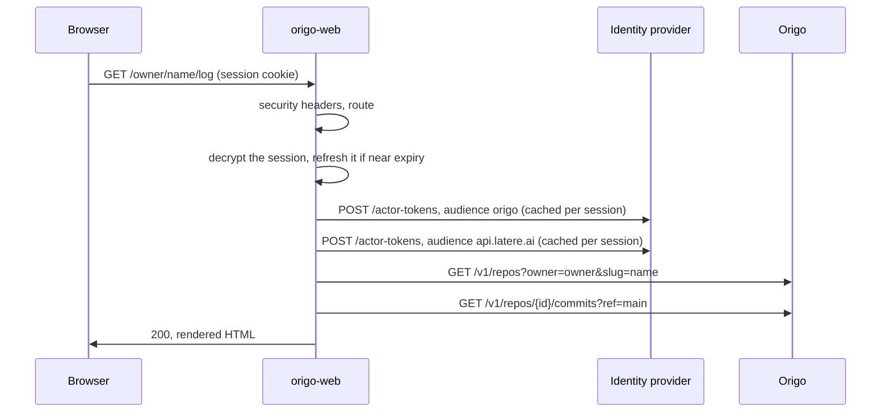

# Architecture

origo-web is a server-rendered client of four HTTP services: Origo, the
identity provider, the repository registry, and the SSH key store. It holds
no repository, runs no git, reads no object storage, keeps no database, and
decides nothing about access. Every fact on a page is what one of those
services answered for the signed-in person.

The module is `github.com/latere-ai/origo-web`. It imports nothing from
Origo: it reaches Origo only through Origo's published API, so the boundary
between the two is one the Go toolchain enforces.

## Package map

| Package | Holds |
|---|---|
| `cmd/origoweb` | `main`: loads the configuration, builds the session manager and the three service clients, and serves until `SIGINT` or `SIGTERM`, then drains for up to 15 seconds. Build metadata arrives through `-ldflags` |
| `internal/config` | the environment read once into `Config`, and every address derived from it: the clone addresses, the address an agent calls, the registry's fallback to the identity provider, the account page, and the issuer origin the framing policy names. Nothing is derived from a request |
| `internal/session` | the signed-in person, over `latere.ai/x/pkg/authkit/oidc`: the encrypted session cookie, the twelve-hour window, the actor tokens per audience, the list of repositories opened in this session, the CSRF token, and both halves of sign-out |
| `internal/origo` | the client of Origo's API: one method per route, the error document read into `Error`, and the response headers read into `Meta` (how stale a read is, whether it was cut) |
| `internal/registry` | the client of the repository registry: owners a person may create under, the ownership row, and visibility |
| `internal/keys` | the client of the SSH key store: list, parse, store, remove. It parses no key material itself |
| `internal/diff` | the unified diff text Origo returns, read into files, hunks, and rows, with the budget that bounds one page |
| `internal/web` | the route table, the handlers (one `page_*.go` per screen family), the shared view model, and the embedded templates, stylesheet, and fonts |

The binary's dependencies are the shared library, the OpenTelemetry SDK its
traced HTTP client uses, the Markdown renderer, and the standard library.
The `depcheck` section of `.lateregate.yaml` lists them and fails the gate
on anything else.

## One request

`Server.ServeHTTP` sets the headers every response carries before the mux
sees the request: the Content-Security-Policy, `X-Content-Type-Options`,
`Referrer-Policy`, and `Cache-Control: private, no-store` on everything but
the assets.

The mux is built from `Routes`, the one list of every method and pattern,
and a map of handlers keyed the same way; a route without a handler panics
at start-up, so the table and the handlers cannot drift. `GET /` catches
every unmatched address and renders the page for an address that does not
exist, rather than the mux's plain text. The probes `/livez`, `/readyz`,
and `/version` are on the same listener and read no session.

Every screen starts with `begin`, which reads the session exactly once per
request. Two reads in one request could each cross the refresh boundary,
and the second would present a refresh token the first had already
rotated, so the issuer would refuse it and a live session would be
cleared. `begin` returns the request's two downstream tokens and the view
every page renders its frame from.

A repository screen then calls `openRepo`, which resolves the owner and
name to Origo's identifier with the person's `origo` token, applies `?ref=`,
and remembers the repository in the session's recent list. The handler
makes its own calls and renders one template.

## Identity

### The session

`internal/session` wraps authkit's relying party and fixes what the library
leaves to its caller:

| Cookie | Holds |
|---|---|
| `__Host-origoweb-session` | the encrypted session: access token, refresh token, expiries, and the identity claims |
| `__Host-origoweb-recent` | up to twelve repositories this session opened, identifier and name, no credential |
| `__Host-origoweb-csrf` | the seed of the token every form carries |

The `__Host-` prefix binds a cookie to this origin and to a secure
connection. With `ORIGOWEB_AUTH_INSECURE_COOKIES` set, for a local run over
plain HTTP, the prefix is dropped because a browser rejects a `__Host-`
cookie that is not `Secure`.

The session window is twelve hours from sign-in. A refresh, which authkit
makes when the access token is within a minute of expiry, renews the access
token and never moves the window, so a stolen cookie has a bounded life.
Any failure to read the session, whether a cookie that does not decrypt, an
elapsed window, or a refused refresh, is one error, `ErrNoSession`, with
the cookie cleared, so a caller has one case to handle.

### Actor tokens

The session token is addressed to the identity provider and opens nothing
else. `Manager.Read` asks the provider for two actor tokens, one addressed
to Origo (`OrigoAudience`, `origo`) and one to the registry and key store
(`PlatformAudience`, `api.latere.ai`). authkit asks for a 300-second
lifetime and caches each token per session and audience until 30 seconds
before it expires, so a page making several calls pays for at most one mint
per audience.

The two mints fail independently and are reported apart, as `Fault` and
`PlatformFault`. A provider that has not granted the second audience still
leaves every reading screen working; only the screens that call the
registry or the key store say the provider did not answer, through
`requirePlatform`.

### Sign-in

`/sign-in` is the page; `/auth/start` hands the browser to authkit's
`HandleLogin`, which redirects to `<issuer>/authorize` with PKCE, `state`,
and `nonce` held in a short-lived flow cookie. `/auth/callback` is
`HandleCallback`: it checks `state`, exchanges the code, verifies the ID
token and its `nonce` when there is one, and writes the session. `return_to`
survives the round trip, and only a path on this origin is accepted, so the
flow cannot be turned into an open redirect. authkit sends a browser whose
flow cookie is gone to `/login`, which renders the sign-in page.

### Sign-out

`POST /sign-out` checks the CSRF token, clears the cookies, and redirects to
`<issuer>/logout` with `post_logout_redirect_uri` set to this service's
`/sign-in`, built from `ORIGOWEB_PUBLIC_URL`. Clearing the cookie alone
would leave the provider's single sign-on session alive, and the next visit
would sign the person straight back in.

`GET /logout/notify` is the front-channel half: the provider loads it in a
hidden frame when the person signs out elsewhere, and it clears the
session. It is the one address whose `frame-ancestors` names anything, and
it names only the issuer's origin. A request whose `Sec-Fetch-Dest` says it
was not loaded as a frame is refused, so a link or an image elsewhere cannot
sign a person out.

## Rendering

**No script.** Templates are `html/template` files embedded in the binary.
Each screen is parsed together with `base.gohtml` and defines `title` and
`main`. Every control is a link, a form, or a native `
` element.
The Content-Security-Policy sets `script-src 'none'`, so a page that grew a
script would stop working in the browser rather than quietly come to depend
on it. Light and dark themes follow `prefers-color-scheme` in `app.css`.

**Assets.** The stylesheet and four IBM Plex font files are served from a
closed list under `/assets/`, so adding a file to the directory does not add
a route. Assets are cacheable for an hour; pages are not cacheable at all,
because Origo's `ETag` is the same for every reader and a shared cache keyed
on it would hand one person's private page to the next.

**Readmes** go through goldmark, via `latere.ai/x/pkg/md`, without its
unsafe option, so raw HTML in a repository is dropped. Headings are demoted
one level so a page keeps one `h1`.

**Files.** The tree call comes first and gives the size before any byte is
fetched. A text file is fetched with a `Range` of 1 MiB, so the cap is
enforced by the request and the rest is never sent. Above Origo's 50 MiB
blob cap nothing is fetched. `raw` streams Origo's response body without
buffering it.

**Diffs.** `internal/diff` reads the text of Origo's compare route and
computes nothing git did not write. `DefaultBudget` collapses a file past
500 changed lines, omits its body past 5,000, and collapses every file of a
patch past 20,000; `Force` names the one path to render in full when the
person asks.

**Sentences.** Every refusal a person reads is written here. The message a
downstream service sends is written for a developer and is never rendered;
its code chooses the sentence, and its detail goes to the log. Origo's 403,
404, and 410 on a read are one sentence, because Origo refuses to say which
it was.

## Writes

The interface changes state in four places, each a POST form with a CSRF
token and each made with the person's own tokens:

| Form | Calls, in order |
|---|---|
| New repository | registry `POST /repositories` with an identifier chosen here, then Origo `POST /v1/repos`. If Origo refuses, the row is removed again on a context detached from the request, so a closed tab does not orphan it |
| Delete | Origo `DELETE /v1/repos/{id}`, then registry `DELETE /repositories/{id}`. The reverse order would turn the deletion into a refusal once the row was gone. A row that outlives the repository is logged for an operator |
| Visibility | registry `PUT /repositories/{id}/visibility` |
| Agent token | Origo `POST /v1/repos/{id}/tokens`. The token is shown once and stored nowhere |

The registry is written first on a creation because a row without a
repository leaves an address Origo answers 404 for, while a repository
without a row would be one nobody owns and nobody can reach.

Whether a person may delete a repository or change its visibility is the
registry's `can_change`, read on each render. The overview's visibility
badge is cached for 30 seconds per reader and repository, keyed by the
reader's subject. A change here overwrites the entry with the new answer
and a deletion drops it; a change made anywhere else shows within the 30
seconds. No decision is made from the cached value.

## Telemetry

Every outbound call goes through the traced client of
`latere.ai/x/pkg/otel`, which the `otel-client` gate enforces. `main` sets
up no exporter, so the spans are discarded, and the service serves no
`/metrics`. Logs are `log/slog` lines on standard error. No token appears
in a log line.
