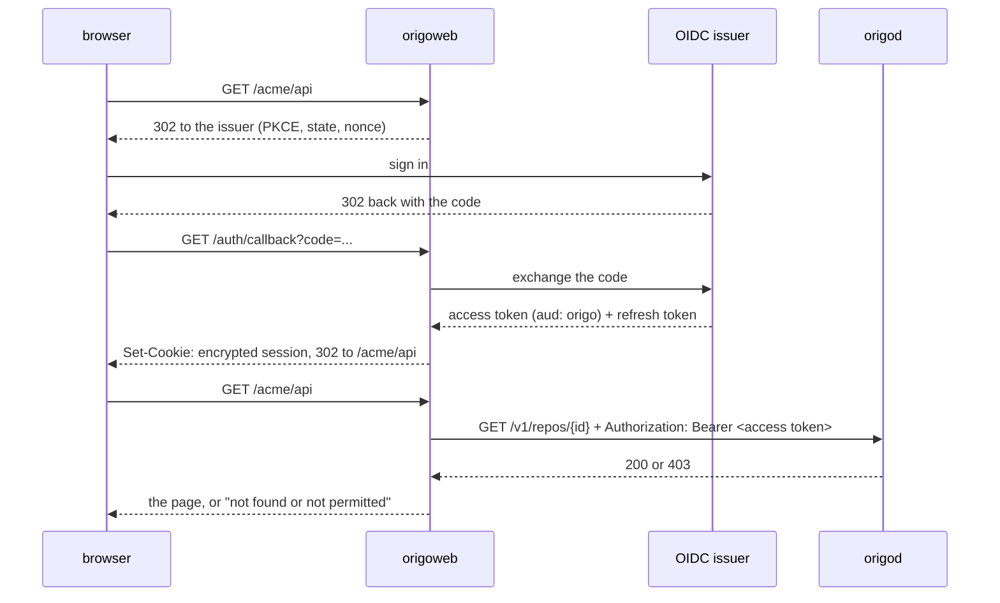

# Web interface

## Overview

Origo has no web surface. Spec 022 puts a sign on the door: a browser
that opens an installation reads a page saying this address is a git
remote. It stops there on purpose, and this spec is what stands behind
it for an operator who wants more: a small, read-only browsing interface
in the spirit of cgit and sourcehut. Repositories, branches and tags,
the commit log, a commit's diff, the file tree, a file. No comments, no
reviews, no stars, no forks, no issues.

It is **a separate service**, not part of Origo. The reasons, recorded
so they are not relitigated:

- Origo is stateless infrastructure with no session, no cookie, no
  template, and no HTML beyond spec 022's one constant page. A browsing
  interface needs all four. Putting them in `origod` would put an OIDC
  relying party, a cookie key, and a template tree inside the process
  that holds the write-ahead log.
- The interface is optional. A self-hoster who wants git hosting and
  nothing else runs Origo alone, and an optional thing that ships inside
  the required thing is not optional in practice: it would be in the
  release archive, in the image, in the configuration reference, and in
  the threat model.
- It is a pure client of a published API. Everything it needs is in
  spec 009 and documented in `docs/api.md`. A contributor to the
  interface reads that page, not Origo's internals, and the boundary
  stays where a boundary that is enforced by a repository split stays.
- The split is sourcehut's: the git host and the browsing interface are
  separate programs that speak over a documented surface.

This spec is written in Origo's deck because the repository it belongs
in does not exist yet. **It moves on the first commit of that
repository** and leaves Origo's deck in the same change; nothing in
Origo depends on it, and its removal from this deck breaks no
cross-reference, because it defines no Origo name.

## Current state

Nothing is built. The pieces it stands on:

- Spec 009's read API is built and released in `v0.1.0`, at `testing`
  on the two items its Outcome names:
  `/v1/repos/{id}/refs`, `/v1/repos/{id}/commits`,
  `/v1/repos/{id}/commits/{sha}`,
  `/v1/repos/{id}/compare/{base}...{head}`,
  `/v1/repos/{id}/tree/{sha}`, `/v1/repos/{id}/blob/{sha}`,
  and `/v1/repos/{id}/archive/{sha}.tar.gz`, with cursor paging,
  `ETag` revalidation, `Origo-Commit` on every response, and
  `Origo-Truncated` where a body was cut.
- Spec 003 serves the repository representation at
  `/v1/repos/{id}` with `owner`, `slug`, `default_branch`, `head`,
  `size_bytes`, `updated_at`, and `pushed_at`.
- Spec 007 verifies a bearer token from any configured issuer, requires
  `aud` to contain `origo`, and asks an operator-run authorizer one
  question per request: may this subject take this action on this one
  repository.
- `latere.ai/x/pkg/authkit/oidc` is the relying party every Latere web
  surface uses: the authorization-code flow with PKCE, ID-token
  verification, an encrypted `__Host-` session cookie holding the
  access and refresh tokens, and refresh. `latere.ai/x/pkg/md` renders
  GitHub-flavoured Markdown and `latere.ai/x/pkg/sanitize` cleans HTML.

Three things it needs and cannot have today, each with its own section
below: a way to list the repositories a person may see, a way to turn
`<owner>/<slug>` into a repository id, and, for a public installation,
a read that carries no token at all.

## Design

### Where it lives

A new repository, `latere-ai/origo-web`, holding one deployable, one
binary `origoweb`, its own `deploy/`, its own gate, and its own tags.

| Option | For | Against |
|---|---|---|
| a directory in `latere-ai/origo` | one CI proves the client against the server; a contract change and its consumer land together | the interface's release cadence is the storage core's; an optional component ships inside the required one; nothing stops a handler reaching into `internal/` and the boundary erodes inside one release; a self-hoster who wants Origo alone still reads about it in the configuration reference |
| **a new repository `latere-ai/origo-web`** | the interface tags on its own clock, and a markup change never asks Origo for a release; a self-hoster runs Origo without it, or runs it against an Origo they did not build; a contributor reads `docs/api.md`, which is the surface the boundary is made of; one deployable per repository is the fleet convention (`drive`, `insula`, `auth`, `pay` each own theirs) | contract drift is not caught by one `make`; the interface must pin an Origo version and prove itself against it |
| folded into another product | the repository list is already in a product's own table | the interface stops being an Origo component and a self-hoster cannot run it |

The one real cost of the split is drift, and it is paid the way Insula
already pays it (its spec 026): the interface pins an `origod` image by
digest and runs its end-to-end tests against that container with the
stub issuer and authorizer of Origo's spec 013, so a contract change
that breaks it fails its own gate on the next bump. Origo's spec 021
conformance suite is what proves the server side; this repository does
not repeat it.

### What it is, in one rule

**The interface holds no git knowledge and no access-control model.** It
never runs git, never reads the bucket, never resolves a reference,
never computes a diff, and never decides who may see what. It sends the
signed-in person's own token to Origo, renders what comes back, and
renders a refusal as a refusal. The one piece of parsing it does is
reading the unified diff text `/v1/repos/{id}/compare/{base}...{head}`
returns so it can be shown as a table; that is presentation, not
computation, and it produces no fact the server did not send.

A consequence that must be written down before someone optimises it
away: **no cache of a rendered page may be shared between subjects.**
Origo's `ETag` is the repository's index sequence, which is the same for
every reader, so a cache keyed on it alone would hand one person's
private repository to the next visitor. Revalidation with
`If-None-Match` is per session and per subject, or it is not done.

### Identity and session



| Decision | Value |
|---|---|
| flow | authorization code with PKCE (S256) against the same issuer Origo trusts, through `latere.ai/x/pkg/authkit/oidc`; the client is registered so its access token carries `aud: origo` |
| where the token lives | only in the AES-encrypted `__Host-` session cookie, `HttpOnly`, `Secure`, `SameSite=Lax`; never in `localStorage`, never in a URL, never in the rendered HTML, never in a log line |
| what is sent to Origo | the person's own access token, unchanged, as `Authorization: Bearer` |
| delegation | none. The interface holds no service credential and mints no token with `act`, so it can do nothing a signed-in person could not do, and only while their token lives |
| access-token lifetime | the issuer's. Spec 007 refuses a token whose `iat` is over 24 hours old, so a session that outlives its access token must refresh, not reuse |
| refresh | when the stored expiry is within 60 seconds, before the call to Origo; the refreshed session is written back to the cookie. A refresh that fails clears the session and redirects to sign-in with the requested path preserved |
| session lifetime | 12 hours from sign-in, not extended by refresh, so a stolen cookie has a bounded life |
| sign-out | a `POST` of `/sign-out` with a CSRF token from `authkit.CSRFIssue`, clearing the cookie |
| CSRF | the two `POST` routes only, sign-out and the key screen. Everything else is a `GET` and changes nothing |

A 401 from Origo means the token was refused; the interface clears the
session and sends the person to sign in once. A repeat is an error page,
not a redirect loop.

### What a signed-out visitor sees

Today: **a sign-in page and nothing else.** Not because the interface
chose that, but because Origo has no anonymous read. Spec 007 requires a
credential on every path of the public listener but `/readyz`,
`/version`, `/.well-known/jwks.json`, and spec 022's two, and spec 016
puts "the authorizer answering allow for an anonymous subject" and
"anonymous reads" outside its scope. There is no public tier and no
`visibility` field anywhere in Origo's model: access is one boolean per
subject, repository, and action, answered by the operator's authorizer.

So a public installation with public repositories is not something this
interface can offer by trying harder. It needs Origo to grow a path
where a request with no credential reaches the authorizer with a subject
that means "nobody". The empty subject is already taken, because
`origod check` sends the reserved probe id with an empty subject and
reads an allow as a misconfigured authorizer (spec 007). A sentinel that
is not the empty string is therefore part of that future work, and it
belongs to an Origo spec, not this one.

What this spec does is make sure the day it lands costs the interface
nothing: **every read is issued with the token if there is one and
without an `Authorization` header if there is not, and the response is
rendered as it arrives.** A signed-out visitor today gets 401 on the
first call and is shown the sign-in page. On an installation that later
answers, the same code path shows the repository.

### The repository list

This is the sharpest question in the design, and the answer is that
Origo cannot answer it.

**Checked.** Origo's whole route table is keyed by a repository id the
caller already holds: the create and lifecycle verbs on `/v1/repos` and
`/v1/repos/{id}`, spec 009's seven read paths, spec 019's
administration paths, spec 020's operations, and the two git URL forms. There is no
collection path and no owner-scoped path. Origo stores no user and no
permission (spec 007), so it could not filter a list even if it had one.
The authorizer contract is a single yes/no oracle over one named
repository, `{"subject", "actor", "repo": {"id", "owner", "slug"},
"action"}` in and `{"allow"}` out, with no batch form, no wildcard, and
no enumerate verb. Nothing published by the authorizer Latere runs exposes
a read at all: its git-plane surface is one authorize call and five
idempotent writes.

**Where the list actually lives.** Not in Origo and not in the bucket.
Origo's name index (`origo/names/<owner>/<slug>` holding an id) knows
which repositories *exist*, and the authorizer knows which of them a
subject may *see*. The list is the intersection, and only the authorizer
can produce the subject side of it without walking every repository in
the installation. So the list belongs to the authorizer, which is the
component that already owns the ownership model. For Latere's
installation that is the `auth` service, whose git-plane tables already
hold repositories, grants, owners, org roles, and team membership in a
snapshot refreshed every ten seconds. It has the answer and no way to
say it.

**What must be added, and to which component.** Two additions, both in
Origo, one of which extends the authorizer contract of spec 007. They
are Origo's to specify and build; this spec states the shape it needs so
that spec is a transcription rather than a design.

```
1. A directory question on the authorizer contract (Origo spec 007).

   POST <ORIGO_AUTHORIZER_URL>
   {"subject": "…", "actor": "…", "action": "list",
    "cursor": "…", "limit": 50}

   200 {"repos": [{"id": "…", "owner": "…", "slug": "…"}],
        "next_cursor": "…"}          the visible page, newest or
                                     lexical order, the authorizer's
                                     choice, stable across pages
   200 {"allow": false, "reason": "…"}   this subject sees nothing
   200 {"directory": false}              this authorizer has no directory

   Every answer is 200, as every answer on this contract already is: a
   non-200 is what spec 007 reads as authorizer_unavailable and fails
   closed on, so an authorizer that has not been taught the question
   must be able to say so without being taken for a broken one. The
   request carries no "repo" object, which is what distinguishes it
   from the three existing actions.

2. A collection route on Origo, in two modes.

   GET /v1/repos?cursor=&limit=
       asks the authorizer the directory question, then serves the
       repository representation for each id it returned, dropping any
       the name index no longer holds. 501 with a code of its own when
       the authorizer answered {"directory": false}.

   GET /v1/repos?owner=&slug=
       resolves the name through the index Origo already reads for the
       git label form, then answers exactly as GET /v1/repos/{id} does
       for the resolved id: the authorizer is asked "read" on that id
       first, and a deny is 403 whether or not the name resolved, so a
       refused caller still learns nothing (spec 007, authorization
       before lookup).
```

Mode 2 is a small change with a large effect: it is what lets the
interface use `/{owner}/{slug}` URLs, which is what a person types, what
the clone URL shows, and what cgit and sourcehut both do. Origo already
performs exactly this resolution for every git request in the label form;
only the JSON surface lacks it.

**Neither addition blocks the build.** Until mode 2 lands the interface
addresses a repository by its id, at `/r/{id}` and below, which every
screen but the list already serves from the routes of spec 009; the
`/{owner}/{slug}` form and the name box arrive together with mode 2, and
the id form keeps working afterwards because an id is what survives a
rename. So the order is: build against ids, gain names with mode 2, gain
the list with mode 1.

**One alternative, rejected on the record.** The signed-in person's
token carries organisation and role claims, so the interface could read
them and ask for each claimed organisation's repositories, with no
change to any contract. That is the second access-control model this
design forbids. It decides visibility from a claim instead of from the
authorizer, and it diverges silently the first time the authorizer
grants a repository outside a claimed organisation, or revokes one
inside it: the person sees a repository they cannot open, or fails to
see one they can. A token says who someone is; only the authorizer says
what they may see.

**Until it lands.** The interface ships with the list screen degrading,
not missing. When the collection read of `/v1/repos` is absent (today
it is answered `invalid_request` as an unknown route) or answers 501,
the home page is a "go to a repository" form, taking `<owner>/<slug>` once
mode 2 is there and an id before that, plus the repositories this
session has already opened, held in the session cookie
and in no server-side store. That is cgit without a scan: navigable, and
honest that it cannot enumerate. Mode 2 is what makes even that form
work, so of the two additions it is the one to build first.

### Screens

`{rev}` is a branch, a tag, or an object id. `{path}` is a path inside
the tree. Every call below goes to the Origo installation with the
person's token; a 403 and a 404 both render as one sentence, "no such
repository, or you cannot see it", because that is the distinction
Origo deliberately refuses to make. Every call in the last column is a
`GET`, and every one of them is a path spec 003 or spec 009 already
serves except the two the section above proposes.

| Screen | URL | What it shows | Calls |
|---|---|---|---|
| sign in | `/sign-in`, `/auth/callback` | what this installation is and one button; the callback exchanges the code and returns to the requested path | the issuer only |
| repository list | `/` | every repository the subject may see: name, owner, default branch, last push, size; paged by cursor | `/v1/repos?cursor=&limit=` (the addition above); degrades to the name form when absent |
| overview | `/{owner}/{slug}` | clone URLs in both forms, the branch and tag selector, the root tree at the default branch, the rendered README below it, the last commit line, a link to the archive | `/v1/repos?owner=&slug=` for the id and the default branch; `/v1/repos/{id}/refs?prefix=refs/heads/` and `?prefix=refs/tags/`; `/v1/repos/{id}/tree/{rev}`; `/v1/repos/{id}/blob/{sha}` for the README entry's sha; `/v1/repos/{id}/commits?ref={rev}&limit=1` |
| branches and tags | `/{owner}/{slug}/refs` | every branch and tag with its target, tags peeled | `/v1/repos/{id}/refs?prefix=refs/heads/` and `?prefix=refs/tags/` |
| commit log | `/{owner}/{slug}/log/{rev}` | one row per commit: short id, summary, author, date; optionally filtered to a path; a "next" link carrying the cursor | `/v1/repos/{id}/commits?ref={rev}&path=&limit=50&cursor=` |
| commit | `/{owner}/{slug}/commit/{sha}` | the message with its trailers, author and committer, parents, the file summary, and the diff against the first parent | `/v1/repos/{id}/commits/{sha}` for the metadata and stats; `/v1/repos/{id}/compare/{base}...{head}` with the first parent as base for the diff |
| compare | `/{owner}/{slug}/compare/{base}...{head}` | the same diff view between any two revisions | `/v1/repos/{id}/compare/{base}...{head}` |
| tree | `/{owner}/{slug}/tree/{rev}/{path}` | one row per entry: name, type, mode, size, and the entry's last commit is **not** shown, because that is one call per row and Origo offers no batch for it | `/v1/repos/{id}/tree/{rev}?path={path}&cursor=` |
| file | `/{owner}/{slug}/blob/{rev}/{path}` | the file with line numbers and anchors, its size and mode, links to raw and to history | `/v1/repos/{id}/tree/{rev}?path={dir}` to find the entry's blob sha and size, then `/v1/repos/{id}/blob/{sha}`; spec 009's blob route takes no `path`, which is why the tree call comes first and why the size is known before any bytes are fetched |
| raw | `/{owner}/{slug}/raw/{rev}/{path}` | the bytes, streamed through with the `Content-Type` Origo detected and `Content-Disposition: attachment` | the same two calls; the blob body is copied, never buffered |
| visibility | `/{owner}/{slug}/visibility` | whether anyone may read the repository, and the button that changes it; administrators only | the registry's visibility read and write |
| delete | `/{owner}/{slug}/delete` | what deleting does, and a form that asks for the name to be typed back; administrators only | the registry's visibility read for who administers; `DELETE /v1/repos/{id}`; the registry's row removal |
| SSH keys | `/keys` | the signed-in person's public keys with their labels, fingerprints, dates and last use; a two-step add; a removal that asks first | the installation's key store: `GET /me/ssh-keys`, `POST /me/ssh-keys`, `DELETE /me/ssh-keys/{id}`; see below |

The archive link on the overview points at
`/v1/repos/{id}/archive/{sha}.tar.gz` on the Origo installation
directly, so a large tarball never passes through this service.

**The key screen is separable, and it is the only screen that talks to
something other than Origo.** Origo stores no public key: its spec 024
resolves an offered key to a subject through an endpoint the operator
runs, and that same component is where a person adds one. This interface
is a client of it, exactly as it is a client of Origo, and it carries the
signed-in person's own token to both.

Latere's key store is auth (its spec 075). An operator running another
identity provider points `ORIGOWEB_KEYS_URL` at whatever they built, and
an operator who built nothing sets it to nothing: the screen and its
navigation entry are absent while it is unset, which is the default.
Everything else in this document is built, reviewed and shipped without
it, and the interface is complete and useful with the whole screen gone.

**This service reads no key.** It does not parse a paste, does not
compute a fingerprint and does not decide what algorithm is acceptable.
That is the same rule as "the interface holds no git knowledge", applied
to the other component it speaks to, and it is what the two-step add
exists to make possible:

```
paste ──▶ POST /me/ssh-keys {public_key, confirm: false}
                 │  the store parses, checks for a duplicate, stores nothing
                 ▼
        the fingerprint the store computed, rendered for checking
                 │  the person confirms
                 ▼
          POST /me/ssh-keys {public_key, confirm: true}
```

Both steps run the same parser in the store, so the fingerprint a person
checked and the key that was saved cannot disagree. A parser here would
be a second one, and two parsers can differ.

Three screens in one address, and each is a page a reader meets: the
table with the add form, the parsed key waiting for a yes, and the
removal asking before it acts. A removal is a link to a page that names
the key and a form on that page, never a link that acts.

**What a row says**, because the point of the table is telling two of
your own keys apart: the label, which is the comment at the end of the
line you pasted; the algorithm beside the fingerprint, as "ed25519" or
"rsa-4096", since a 2048 bit RSA key is the weakest thing an
installation accepts and which one a key is matters; the day it was
added; and when it was last used. "never used" is the one red in the
product and it sits beside the words rather than instead of them, so it
survives greyscale and a screen reader reads the same fact.

**What a refusal says** is written here and never quoted from the store.
The store answers a code for whoever reads its API; a person meets one
sentence. A key already on the account and a key on somebody else's are
two different facts and get two different sentences, and a store that
will not talk to this client at all is the installation's problem and is
not written as though the person could fix it.

### Rendering

Server-rendered HTML from Go's `html/template`, one binary, no build
step, no bundler, no framework, no dependency the page fetches from
another host. Every page is complete and usable with JavaScript
disabled. The only script is progressive enhancement that a page works
without: the branch selector is a `<form>` that submits, and a script
may make it navigate on change.

| Constraint | Rule |
|---|---|
| structure | one `<h1>` per page, sections under `<h2>`; the tree and the log are `<table>` with `<th scope="col">`; the diff is a table with a row per line |
| theme | light and dark from `prefers-color-scheme`, both defined; no theme switch, no cookie, no flash of the wrong theme because there is no script to cause one |
| code and hashes | one monospace stack, used for paths, object ids, diffs, and file content, nowhere else |
| page width | one rule: the shell is the viewport less a gutter, and the measure is a property of running text, set once, in `ch`, on the blocks that hold prose. A table, a tree, a commit log, a diff and a file are data rather than prose and take the whole shell |
| narrow width | usable from 320 CSS pixels: the body never scrolls sideways; the tree, log, and diff tables scroll inside their own container |
| identity | the masthead is where the installation names itself, once a screen: the name, and a mark beside it when one is configured. Nothing below it restates either |
| focus and contrast | every interactive element has a visible focus ring that is not the colour alone; text and its background meet WCAG AA in both themes |
| links | every navigation is an `<a href>` to a real URL, so a page can be bookmarked, opened in a new tab, and read by a crawler that runs nothing |
| identifiers | line anchors on the file view (`#L42`) and per-file anchors on the diff |
| syntax highlighting | not in v1. It is a large dependency, a large attack surface over untrusted file content, and it is not needed to read a diff |
| staleness | when Origo answers with `Origo-Stale`, the page carries one line saying this view may be a few minutes behind and why. A machine consumer ignores that header; a person reading a commit log must not |

### Limits

The three cases that decide whether this is usable on a real repository.

| Case | What Origo does | What the page does |
|---|---|---|
| a 5 000-line diff | `compare` returns at most 1 MiB, cut at a file boundary, with `Origo-Truncated: true` | renders every file it received, each collapsed past 500 lines with a control that expands it; above the diff, one line saying the server cut it and how to see the rest. A single large file is re-requested on its own with `path=`, which is exactly the case the 1 MiB cap was hit by |
| a binary file | `compare` writes `Binary files differ`; `blob` serves the bytes with the type from the first 512 bytes | the diff shows the file's row with "binary" and no body. The file view shows name, size, mode, and detected type, with a download link and no bytes: a file is rendered as text only when the detected type is textual and the bytes decode as UTF-8 |
| a very large file | over 50 MiB `blob` answers 413 `blob_too_large` without a `Range`; under it the whole body is served | the tree gives the size before any bytes are fetched. Over 1 MiB the file view is not rendered: it shows the size and offers raw and clone. Under it, the body is requested with `Range: bytes=0-1048575` so the cap is enforced by the request and not by reading and discarding. The raw route streams whatever Origo gives, up to Origo's own limit, and a 413 renders as "too large to serve; clone the repository" |

Two more bounds worth stating because a slow page is a broken page: a
tree page is one `tree` call and never `recursive=1`, so a repository
with 100 000 files costs one page of 5 000 entries; and no screen makes
a number of calls that depends on the number of rows it shows.

### Deployment

One container image, one binary, one process, no database, no volume,
no queue, no migration. It is stateless: everything it knows is in the
request and the cookie.

| Setting | Default | Purpose |
|---|---|---|
| `ORIGOWEB_ADDR` | `:8080` | the listener |
| `ORIGOWEB_ORIGO_URL` | none, required | the base URL of the Origo installation, the one address it talks to |
| `ORIGOWEB_PUBLIC_URL` | none, required | its own base URL, used to build the redirect URI and absolute links |
| `ORIGOWEB_CLONE_HOST` | `ORIGOWEB_ORIGO_URL` | what the clone URLs on the overview name, for an installation whose git host differs from its API address |
| `ORIGOWEB_SSH_CLONE_HOST` | unset | the host shown for the SSH clone form; unset means only the HTTPS form is shown, which is what an installation without the SSH surface gets |
| `ORIGOWEB_KEYS_URL` | unset | the base address of the installation's key store, which serves `/me/ssh-keys`; the key screen and its navigation entry exist only when it is set, and an address that does not parse is a start-up failure rather than a screen quietly missing |
| `ORIGOWEB_ISSUER_NAME` | unset | what the sign-in button calls the identity provider |
| `ORIGOWEB_PRODUCT_NAME` | `Origo` | what the installation calls itself, in the masthead and the tab title |
| `ORIGOWEB_PROJECT_URL` | the Origo repository | where the signed-out page links to the open-source project |
| `ORIGOWEB_BRAND_MARK` | unset | the brand mark drawn beside the product name; `latere` is the only value this binary carries, and an unknown value is refused at start |
| `AUTH_URL`, `AUTH_CLIENT_ID`, `AUTH_CLIENT_SECRET`, `AUTH_REDIRECT_URL`, `AUTH_COOKIE_KEY`, `AUTH_AUDIENCE`, `AUTH_SCOPES` | the library's | read by `authkit/oidc` with the prefix `ORIGOWEB`; `AUTH_AUDIENCE` must be the audience Origo verifies, and `AUTH_URL` must be an issuer in the installation's `ORIGO_OIDC_ISSUERS` |

### The software and the installation are not the same name

Origo is the open-source project. A running installation is an instance
of it, and may be operated under a name of its own: Latere's is Latere
Code. The distinction is a configuration boundary and not a string in a
template.

- `ORIGOWEB_PRODUCT_NAME` is the name the interface calls itself,
  everywhere it names itself. Unset, it is the project's own name, so
  an installation nobody named is Origo and says so.
- `ORIGOWEB_BRAND_MARK` is separate from the name, because a mark
  belongs to whoever owns it. Nothing is drawn unless an operator asks
  for one by name; the only mark the binary carries is Latere's, and an
  operator who names their own installation gets their name and not
  Latere's logo.
- The signed-out page, the one screen a stranger reads, leads with what
  a reader can do here, says that the software is open source, and links
  to `ORIGOWEB_PROJECT_URL`. Which installation it is comes from the
  masthead above it, which is on every screen, so the card does not
  repeat the name or the mark. Every other screen is for a person who is
  already inside and says none of it.

**It runs on its own hostname**, not on Origo's. Origo's git surface
claims `/{owner}/{slug}/...` for smart HTTP, which is precisely the
shape a browsing interface wants; one hostname cannot serve both without
a rule that will be wrong the first time a repository is named like a
route. `code.example.com` in front of the interface and
`git.example.com` in front of Origo, two Ingress rules, one certificate
each. The interface reaches Origo over the address an operator gives it,
which may be the in-cluster Service.

**What a self-hoster does**, after Origo's `docs/install.md`: register a
second OIDC client for the browser flow whose tokens carry Origo's
audience, generate a cookie key, apply this repository's manifests with
the settings above, point a hostname at it, open it, and sign in.
Nothing in Origo's installation changes, and an operator who skips all
of it has an installation that works exactly as before.

### What the visual design must supply

The design is produced separately. This spec fixes structure, content,
and behaviour and fixes no appearance. What the design owes back, as
slots rather than qualities:

- The diff table: the added, removed, and context row treatments, the
  two line-number gutters, the per-file header with its path and its
  add/remove counts, the collapsed-file state, and the row that says a
  file is binary.
- The tree row: name, type, mode, size, and how a directory differs from
  a file at a glance and to a screen reader.
- The commit log row and the commit header, including how a merge and
  its parents read.
- The reference selector: branches and tags in one control that works as
  a plain form.
- Every empty, truncated, refused, and error state, each of which has a
  sentence in this spec and needs a place to sit: an empty repository, a
  truncated diff, a file too large, a binary file, a stale view, "no such
  repository, or you cannot see it", and Origo unreachable.
- The token pairs for both themes with their measured contrast ratios,
  the focus ring, and the monospace and text stacks with real fallbacks.
- The narrow-width behaviour of the three tables, and what the header
  and the reference selector become at 320 pixels.
- A prose block and a data screen side by side at a desktop width, which
  is where the one width rule is legible: the same shell, bounded text,
  unbounded tables.

### Visibility

A repository is private or public. A public one is read and cloned with
no account at all (auth's spec 077, Origo's spec 027). Origo holds no
visibility, so the interface reads and writes it at the registry with the
person's own token, beside the create call it already makes there.

Two surfaces, and no more.

- The overview names the state in the facts row, and there are **three**
  of them, not two: `public`, `private`, and an answer the registry could
  not give, which says so in words. A failure must never render as
  private. If it did, a public repository would read exactly like a
  private one, and it would be wrong in the direction nobody reports: the
  screen looks right to the reader, and the person who made it public is
  not told it stopped saying so. A fourth case renders nothing at all,
  which is an installation whose registry keeps no visibility, because
  there the question has no answer rather than an unavailable one. For
  somebody who may change it there is one link to the screen below.
- Origo cannot supply the answer. It holds no visibility by the design of
  its spec 027, so the repository record the overview already fetches
  cannot carry the field and there is nothing to fold the call into. The
  call is irreducible, so it is **cached** rather than repeated: keyed by
  reader and repository, because `can_change` is an answer about a person
  and one reader's right to change a repository is never served to
  another, and kept for **30 seconds**. A flip made here is written
  through to the cache, so the person who made the change sees it at once
  and the lifetime never applies to them. What the lifetime bounds is a
  change made in another session or through the registration API: half a
  minute of a stale badge, stated rather than accidental. No decision is
  made from the cached value; the registry decides every read and every
  write, whatever the badge says. The badge is never filled in after the
  page, because that would need script.
- `GET /r/{id}/visibility` is the change screen and `POST` applies it. It
  is a screen and not a control on the overview, because the person has
  to read one sentence before they press the button and this interface
  runs no script, so there is no dialog to read it in. The screen says
  what changes, then offers the button.

The copy is fixed here because the private direction is the one a person
has to be told about:

> Making it private: Only people you have given access can read this
> repository. Copies that were already cloned stay where they are. Making
> it private does not delete them.

> Making it public: Anyone can read and clone this repository. They do
> not need an account. The code, every branch, every tag, and the full
> history become readable. Nobody can push to it without access. It does
> not appear in any list.

Somebody who may read a repository but not administer it gets the
interface's one refusal, which is the same answer an absent repository
gets, so nobody learns which it was.

## Not in this spec

Written out so a later contributor reads it as a boundary and not as a
gap. The interface has **no write path to repository content of any
kind** and never will: no editing a file, no creating a branch or tag,
no merging, no reverting, no uploading, no rename, transfer, or freeze.
Origo's specs 019 and 020 serve those to a platform's own API, which is
where the audit trail and the workflow belong. Two sections below say
why creation and deletion, which this list once carried, are admitted
and on what terms.

It also does not have, and must not grow: comments, code review, pull or
merge requests, discussions, stars, watches, forks, issues, wikis,
projects, milestones, activity feeds, notifications, user profiles,
follower graphs, badges, or a search over content. Nothing about it
counts, ranks, or recommends. It is a window onto a git repository for
people who already know which repository they want.

Also out: syntax highlighting, blame, a graph view of history, an
in-browser terminal, and any rendering of a file format beyond Markdown
and plain text. Origo's spec 009 already scopes out search, blame, and
rendering on the server side; this spec does not smuggle them onto the
client.

### Creating a repository, which this spec once excluded

This section narrows the exclusion above, and says why the narrowing is
not the first step onto a slope.

The sentence originally read "no repository creation, rename, transfer,
freeze, or deletion". Four of those five change a repository that
exists, and they stay out for the reason they were written out: they
belong to a platform's own API, where the audit trail and the workflow
are. **Creation is not one of them.** It changes no repository, moves no
reference, and writes no byte of content; it brings an empty repository
into being. The rule the section is named for, "no write path to
repository content", is untouched by it.

What forced the question was the empty state. A signed-in person opening
the repositories screen with nothing on it had no answer to "how do I
make one", and the honest answer at the time was that nobody could:
creation was a product operation, admitted to a registered service
client and to nobody else. An interface whose only answer to its own
empty state is "ask an administrator" is not a small interface, it is an
incomplete one.

| Decision | Value |
|---|---|
| the routes | `GET /new` renders the screen, `POST /new` creates, with the form token every other form requires |
| the credential | none of its own. Both calls carry the signed-in person's own token, so the `delegation \| none` row above still holds in full: a bug here can create nothing a person could not create with curl at the same two addresses |
| who decides | the installation's authorizer, which is the component that holds the names and the record of who owns what. This interface asks and renders; it holds no ownership model and no second copy of one |
| what a person may create under | what the authorizer says: their own name, and an organisation they administer. The screen draws the answer and never derives one from a token claim, for the reason the repository list gives at length |
| the order | the ownership row first, the repository second, which is the authorizer's own rule: the failure that leaves a repository unreachable is preferred to the one that leaves it unguarded |
| where a person lands | on the repository, at `/r/{id}`, which is also added to the addresses this session has opened |
| an installation with no such component | no screen and no affordance. `ORIGOWEB_AUTH_URL` is the address, because the provider that issues the token is the one that holds the names; unset, the creation screen is absent exactly as the key screen is |

The second call is retried, up to three attempts spaced past Origo's own
deny cache, and only on the one refusal a fresh ownership row produces
while the authorizer's replicas catch up. Every other refusal is the
answer. When no attempt succeeds the row is withdrawn, on a context
detached from the request: the case the withdrawal exists for is the
person who submitted the form and closed the tab, and a call made on the
request's own context would fail the moment the browser went and leave
behind exactly the row it was added to remove.

Renaming, transferring and freezing stay out, and so does granting
another person access. The line this section draws is between bringing a
repository into being and changing one that exists, and it is the same
line Origo's own create route draws. Deletion crosses it, and the next
section says on what terms.

### Deleting a repository, which this spec once excluded

The section above kept deletion out with rename, transfer and freeze,
because the four change a repository that exists and belong with the
audit trail and the workflow of a platform's own API. Deletion is
admitted here on narrower terms than creation was, and the terms are
what keep it from being a step onto the slope.

What forced the question has the same shape as before. An interface that
can bring a repository into being and cannot take one away leaves a
person with a repository they made by mistake and no answer but "ask an
administrator". Nothing in Origo makes that the right answer. Its delete
(spec 020) is a hold, not a purge: the repository stops answering at
once, the content is kept for `wal.DeleteHold` and an administrator can
undelete it through the API within that time. The audit trail is
Origo's own: an entry in the repository's log carrying the subject and
the actor, and an event.

| Decision | Value |
|---|---|
| the routes | `GET /{owner}/{slug}/delete` renders the screen, `POST /{owner}/{slug}/delete` deletes, with the form token every other form requires |
| the credential | the person's own token, as everywhere. A bug here can delete nothing a person could not delete with curl at Origo's own address |
| who decides | the authorizer, twice. The screen is shown to the people the registry says administer the repository, which is the same answer it gives for the visibility screen, and Origo asks its authorizer again on the deletion itself. A reader who is not an administrator gets the one refusal |
| the confirmation | the screen names the repository, says what happens, and the person types `owner/slug` back. There is no script, so there is no dialog; the typed name is the safeguard, and the server checks it |
| the order | Origo first, the ownership row second, which is the reverse of creation for the same reason: the authorizer answers from the row, so a row withdrawn first turns the deletion into a refusal and leaves the repository standing under no name. A row that outlives the deletion holds the name and is logged, which is the lesser failure |
| where a person lands | on the repository list, which says what was deleted; the repository is taken out of the addresses this session has opened |
| what this interface does not offer | undelete, and everything else in spec 020: rename, transfer, freeze, import, export. The hold is Origo's, and restoring within it is an administrator's call through the API |
| an installation with no ownership component | no screen, as with creation |

## What must land first

| Item | Owner | Blocks |
|---|---|---|
| name resolution on Origo's JSON surface, mode 2 above | a new Origo spec | nothing; without it every screen is addressed by id at `/r/{id}` and the `/{owner}/{slug}` URLs and the name box wait for it |
| the directory question on the authorizer contract and the collection route, mode 1 above | a new Origo spec, and the authorizer each installation runs | the repository list screen alone; everything else degrades to the name form |
| the repository `latere-ai/origo-web` | this spec moves into it on its first commit | the build |
| a key management surface: spec 024 keeps keys out of Origo, behind an operator-run resolver Origo only reads | **done**: auth's spec 075 serves the resolver and the three `/me/ssh-keys` routes; an operator running another provider builds the same three | nothing |
| an anonymous read path, with a subject sentinel that is not the empty string | an Origo spec; spec 016 scopes it out today | a public installation showing anything to a signed-out visitor |

The first two touch the authorizer contract, which is a contract an
operator implements, so they are Origo's to decide and not this
service's to assume.

## Acceptance criteria

Every test named below is proposed and lands in `latere-ai/origo-web`.
The end-to-end tests run against a pinned `origod` container with
Origo's stub issuer and stub authorizer (spec 013) and a fixture
repository, so they assert against the real read API and not a mock.

- The visibility screen says what changes in both directions, an
  administrator flips a repository both ways, a reader gets the one
  refusal, an unknown value writes nothing, and the overview names the
  state (`internal/web`, `TestVisibilityScreenSaysWhatChanges`,
  `TestVisibilityChangesBothWays`, `TestVisibilityIsNotForAReader`,
  `TestVisibilityRefusesAValueItDoesNotKnow`,
  `TestOverviewShowsThePublicBadge`).
- A registry call that fails renders as neither public nor private and
  says so in words, so a public repository can never read as private
  because of an outage (`internal/web`,
  `TestAFailedVisibilityCallDoesNotReadAsPrivate`).
- Deleting is offered to an administrator from the overview, asked about
  on a screen that names the repository and says what happens, refused
  until the name is typed back exactly, done at Origo before the
  ownership row is withdrawn and not at all when Origo refuses, taken
  out of the addresses this session opened, and said on the list it
  lands on; a reader gets the one refusal from both the screen and the
  form (`internal/web`, `TestDeletingARepositoryAsksFirst`,
  `TestDeletingARepositoryNeedsItsNameTyped`, `TestDeletionIsNotForAReader`,
  `TestADeletionOrigoRefusesWithdrawsNoRow`).
- The overview asks the registry once per reader per repository rather
  than once per render, and a flip is visible on the next render without
  waiting out the lifetime (`internal/web`,
  `TestVisibilityIsAskedOncePerReader`).
- Signing in redirects to the issuer with PKCE and a nonce, the callback
  exchanges the code and lands on the originally requested path, and the
  session cookie is `__Host-` prefixed, `HttpOnly`, `Secure`,
  `SameSite=Lax`, and decrypts only with the configured key (proposed:
  `internal/session`, `TestSignInRoundTrip`).
- No response body, no URL, and no log line contains the access or
  refresh token, asserted over every screen in the end-to-end run
  (proposed: `test/e2e`, `TestTokenNeverLeavesTheCookie`).
- A session whose access token is within 60 seconds of expiry is
  refreshed before the call to Origo, a refresh failure clears the
  session and redirects to sign-in once with the path preserved, and a
  session older than 12 hours is refused whatever its tokens say
  (proposed: `internal/session`, `TestRefreshAndSessionLifetime`).
- A signed-out visitor gets the sign-in page on every repository URL,
  and the same handler, given an Origo that answers a tokenless read,
  renders the repository instead, with no branch on "is there a session"
  in the read path (proposed: `internal/web`,
  `TestAnonymousRendersWhateverOrigoAnswers`).
- Every screen renders with JavaScript disabled and every navigation is
  an `<a href>` or a `<form>`: the end-to-end run visits each screen with
  scripting off and asserts the same content as with it on (proposed:
  `test/e2e`, `TestEveryScreenWorksWithoutScript`).
- Each screen makes exactly the calls this spec's table lists and no
  more, against a recording Origo, and no screen's call count grows with
  the number of rows it renders (proposed: `internal/web`,
  `TestScreenCallsAreExact`).
- A 403 and a 404 from Origo render the same sentence and the same
  status, so the interface leaks no distinction Origo refuses to make
  (proposed: `internal/web`, `TestRefusalAndAbsenceAreIndistinguishable`).
- A rendered page is never served to a second subject: a cache
  populated by one session is not read by another, asserted by two
  sessions against one repository where the authorizer allows the first
  and denies the second (proposed: `test/e2e`,
  `TestNoCacheIsSharedBetweenSubjects`).
- A commit whose diff Origo truncates renders every file received, the
  truncation notice, and a per-file link that re-requests one path;
  a 5 000-line diff renders in under 500 ms after the response
  (proposed: `internal/diff`, `TestTruncatedDiffRenders`;
  `internal/web`, `TestLargeDiffRenderBudget`).
- A binary file shows type, size, and a download link and no bytes; a
  10 MiB text file is requested with a `Range` and shows a truncation
  notice; a 60 MiB file is not fetched at all and shows the size and the
  clone hint (proposed: `internal/web`, `TestFileViewLimits`).
- The values a page is likely to be quoted from sit in one shut `details`
  element: one label a value, every field readonly, no button, and no field
  for a value the installation could not supply. The file screen leads with
  the permalink, which is a whole address at the commit the read resolved to.
  The interface has no copy button anywhere, because a button that copies
  needs a script, and this is a departure from the interface specification,
  which draws one beside each field (proposed: `internal/web`,
  `TestTheQuotableValuesSitInOneDisclosure`).
- A page's machine views are the last block of it, under a hairline, opened
  by the word `machine` and named by format. It is a `footer` after the
  screen's `main` rather than the last child of it, which is the second
  departure here: one block in the shell puts the line on every screen that
  has one without every screen carrying a copy of it, and a `footer` in the
  page is a landmark of its own. Each address is this same page
  plus a suffix and answers what the link says; the same addresses are
  `<link rel="alternate">` in the head. A screen with no machine view carries
  no line, which is a departure from the interface specification's "on every
  page": the specification's list is `json`, `raw` and `patch`, and this
  service publishes no representation of its own, so it offers the two Origo
  already serves and no `json` at all (proposed: `internal/web`,
  `TestAMachineViewIsTheSameAddressPlusASuffix`,
  `TestTheMachineLineIsTheLastBlock`).
- The file screen says whether its address moves. A file read at a reference
  says the next push can change it and offers the pinned address; a file read
  at a commit says the address holds and offers the way back to the default
  branch. The pinned address is the commit Origo named in `Origo-Commit`, so
  it costs no second call, and a read that named none carries no strip at all
  (proposed: `internal/web`, `TestAFileSaysWhetherItsAddressMoves`,
  `TestAnObjectIDIsToldFromAName`).
- A directory listing counts the rows on the screen and offers that
  directory's own history beside the count. It counts the page and never the
  directory, because Origo pages a tree by cursor and returns no total
  (proposed: `internal/web`, `TestATreeCountsWhatItShows`).
- A commit names its committer only where the committer is not the author,
  which is what a rebase, a cherry-pick and an applied patch leave behind
  (proposed: `internal/web`,
  `TestACommitNamesItsCommitterWhenItIsNotTheAuthor`).
- A commit screen with a file rendered shut offers one address that opens
  every one of them and one address back. Neither is offered where it would
  do nothing, and opening every file renders no body the per-file budget
  dropped (proposed: `internal/web`, `TestACommitOpensEveryFileOnAsking`).
- The tree, log, and file screens page with Origo's cursors and every
  entry appears exactly once over a repository with a 5 001-entry
  directory and 100 commits (proposed: `test/e2e`, `TestPagingIsExact`).
- The commit log's pager keeps both halves on every page and offers the one
  address Origo's cursor can produce. The older link carries the cursor and
  names how many commits it fetches; the newer half is text, because the
  walk goes one way and the page before this one has no address. The last
  page offers no link at all (proposed: `internal/web`,
  `TestTheLogPagerWalksOneWay`).
- The reference selector lists branches and tags from `refs` and
  switching one is a form submission that lands on the same screen at
  the new revision (proposed: `internal/web`, `TestReferenceSelector`).
- The overview shows one clone form at a time, built from the configured
  clone host and never from a request header. The other form is a link to
  this same screen carrying `clone=ssh`, so choosing between them is a
  render and not a script swapping two strings, and an installation with
  no SSH surface offers no choice (proposed: `internal/web`,
  `TestCloneURLsComeFromConfiguration`).
- The overview's heading area is a wrapping list of facts rather than a
  sentence, so a fact can join the end of it without moving the others
  and without a second line appearing under the heading. The reference
  picker is a native `details` element holding the same radio group the
  references screen uses, so it is one line until a reader wants it and
  it opens with no script (proposed: `internal/web`,
  `TestReferenceSelector`, `TestNoScreenCarriesANativeMenu`).
- Every page has one `<h1>`, every table a header row with `scope`,
  every interactive element a visible focus style, and no automated
  accessibility violation at AA, over each screen in both themes
  (proposed: `test/e2e`, `TestAccessibility`).
- Every screen renders at 320, 768, and 1280 CSS pixels with no
  horizontal overflow of the document (proposed: `test/e2e`,
  `TestNarrowWidths`).
- A response carrying `Origo-Stale` renders the staleness line and the
  same content (proposed: `internal/web`, `TestStaleNotice`).
- The interface has no route that changes repository content: the route
  table is asserted against a checked-in list, and the only non-`GET`
  routes are sign-out, the mint form, the creation form and the two on
  the key screen, each requiring a CSRF token (proposed: `internal/web`,
  `TestRoutesAreReadOnly`, `TestAKeyFormNeedsItsToken`).
- A signed-in person creates a repository under a name the authorizer
  says is theirs and lands on it; the ownership row and the repository
  carry one id; both calls carry the person's own token and no other
  credential (proposed: `internal/web`,
  `TestCreatingARepositoryLandsOnIt`,
  `TestTheCreationScreenSendsOnlyTheReadersToken`).
- A creation refused for a name that is not theirs, a name already
  taken, an owner at its limit, and a request the authorizer will not
  read are four sentences and four statuses, each with the form filled
  in as it was left, and none of them reaches Origo (proposed:
  `internal/web`, `TestEveryRefusalIsItsOwnSentence`). A name Origo
  would reject never becomes a row (proposed: `internal/web`,
  `TestANameTheInstallationWillNotTakeIsRefusedBeforeARowIsWritten`).
- Only the refusal a fresh ownership row produces is retried, and a
  creation that never succeeds withdraws the row it wrote (proposed:
  `internal/web`,
  `TestACreationRetriesOnlyTheRefusalTheRegistryLagProduces`,
  `TestACreationThatFailsKeepsNothing`), including when the browser that
  submitted the form has gone (proposed: `internal/web`,
  `TestTheRowIsWithdrawnEvenWhenTheBrowserIsGone`).
- A person who holds no name is told what to do next rather than shown a
  form, and an installation with no ownership component offers no
  affordance and answers the address as one it does not serve (proposed:
  `internal/web`, `TestAPersonWithNoNameIsToldWhatToDo`,
  `TestTheCreationAffordanceFollowsTheInstallation`).
- The repository list groups by owner, with one table and one caption an
  owner, so the owner is written once as its group rather than on every
  row. A filter over the list is offered only when the whole directory
  arrived in one answer: Origo has no filter parameter and no question
  that crosses a page, so a filter beside a cursor would search one page
  of fifty and look like it had searched everything the reader may see
  (proposed: `internal/web`,
  `TestTheDirectoryIsGroupedByOwnerAndFilteredWhenItIsWhole`).
- With no key store configured, the key screen and its navigation entry
  are absent and every other screen is unchanged (proposed:
  `internal/web`, `TestKeyScreenIsOptional`).
- A paste is shown back as the store's own fingerprint and stored only
  on a second submission, and a confirmed add lands on the list through
  a redirect so a reload repeats nothing (proposed: `internal/web`,
  `TestAddingAKeyIsTwoSteps`).
- This service reads no key: a paste it could not have parsed and a
  fingerprint it could not have computed both reach the screen unchanged
  (proposed: `internal/web`, `TestTheScreenReadsNoKeyItself`).
- A refused paste keeps what was typed, says what was wrong in this
  service's own words, and never shows the store's; a key already on the
  account and one on another account get two different sentences
  (proposed: `internal/web`, `TestARefusedPasteKeepsWhatWasTyped`,
  `TestADuplicateSaysWhichKindItIs`).
- A removal is asked about on a page that names the key, and an id that
  is not the reader's is answered exactly as one that does not exist
  (proposed: `internal/web`, `TestRemovingAKeyAsksFirst`).
- A store that is down says so, says the keys themselves keep working,
  and offers no form that cannot work; a store that refuses this client
  is written as the installation's problem (proposed: `internal/web`,
  `TestAnOutageSaysSoAndOffersNoForm`,
  `TestTheStoreRefusingThisClientIsAnOperatorProblem`).
- A key id is escaped into one path segment, so an id carrying a slash
  or a `..` cannot address another key (proposed: `internal/keys`,
  `TestRemoveDeletesByID`).
- Every page-wide property holds on all three key screens, which are
  rendered into the set every such test runs over (proposed:
  `internal/web`, `keyScreens` in `everyPage`).
- With the collection read of `/v1/repos` absent or answering 501, the
  home page is the
  name form and the recently-opened list, and the rest of the interface
  is unaffected (proposed: `test/e2e`, `TestListDegradesWithoutDirectory`).
- The masthead names the signed-in person on every screen, once, beside
  the sign-out control, and names nobody when nobody is signed in. The
  claim shown is the most human one the session already holds, in the
  order display name, name, address, subject, and it costs no call to
  the issuer and no scope the client does not already request
  (proposed: `internal/session`, `TestWhoIsTheMostHumanClaimPresent`,
  `TestReadCarriesTheTokenAndWhoHoldsIt`; `internal/web`,
  `TestTheSignedInAccountIsNamed`,
  `TestTheAccountShownIsTheMostHumanClaimTheTokenCarries`).
- A screen with nothing on it says which account it is empty for: the
  repositories screen without a directory, and with an empty one
  (proposed: `internal/web`,
  `TestAPageWithNothingOnItSaysWhichAccountItIsEmptyFor`).
- The front door has three states and answers a status for each. A
  visitor who presented no credential reads the way in and no claim
  about a credential, at 200. A session whose credential Origo turned
  away reads the refusal, at 401, with the dead credential cleared. A
  session Origo answers reads the repositories screen (proposed:
  `internal/web`, `TestTheFrontDoorClaimsNothingItCannotKnow`).
- The body of a screen keeps the masthead's left and right edges: the
  measure binds a block of text and never a container, no box between
  the masthead and the content narrows or centres itself, and the
  documentation holds its far edge with the section list beside the
  words (proposed: `internal/web`, `TestTheBodyKeepsTheMastheadsEdges`).
- The front door is the one screen bounded and centred, and the exception
  is named rather than left to a selector nobody listed. Every other
  screen holds its far edge with a table, a tree, a log, a diff or a
  document's samples; the door has a button and three short paragraphs,
  so at a desktop width its sentences would stop at the measure with the
  rest of the window empty beside them. Exactly one rule bounds the
  door's column, and the column is centred, so the window sits either
  side of it rather than on one side (proposed: `internal/web`,
  `TestTheBodyKeepsTheMastheadsEdges`).
- No screen carries a native menu: no `select`, `option`, `optgroup` or
  `datalist` on any page, and the long choices are radio groups in a box
  that scrolls (proposed: `internal/web`,
  `TestNoScreenCarriesANativeMenu`).
- Text that does the same job carries the same role class, each role
  defined by one rule: an option is a title and a note as two elements,
  no choice marks its title by hand, no field hint is styled by hand,
  and no element on any screen carries an inline style (proposed:
  `internal/web`, `TestTextThatDoesTheSameJobLooksTheSame`).
- A heading looks like its role and not like its screen. A heading
  element carries document structure and a role class carries the look;
  every heading a reader meets wears exactly one role; each role is
  defined by one rule; no selector reaches a heading through a screen to
  change its typeface, size, weight, letter-spacing or line-height; and
  monospace on a heading is the one role whose content is a machine
  string. Rendered Markdown is authored content and is exempt (proposed:
  `internal/web`, `TestAHeadingLooksLikeItsRole`).
- The palette is Latere Design System v2, transcribed from
  `latere-ai/frontend/src/styles/tokens.css`: the neutral ground, surface
  and raised tones, the three-step neutral ink ramp, the two hairlines and
  the radii ladder. v2's rule is that the accent is the ink and a product
  colour is a wordmark and never a page theme, so this product redeclares
  one accent over that base, the way cella, industria, lux and topos each
  do, and changes nothing else. The accent appears on a link, a focus ring
  and the one filled control on a screen, and on no panel, heading or
  background.
- The muted tone marks and does not inform. v2's muted ink is 2.6:1 on a
  surface, so nothing a reader has to read is set in it: a line number, a
  column header, a breadcrumb and a timestamp all take the secondary ink,
  and the muted tone is left to a path separator, an inert pager half and
  a disclosure arrow. The rules allowed to read it are enumerated in the
  test (proposed: `internal/web`, `TestBothThemesMeetTheirContrast`).
- Every colour pair the interface paints is measured in both themes, from
  the token values themselves, with a translucent token composited over
  the surface it is painted on: the body ink holds 7:1 on the ground, a
  panel and a raised tone, the secondary ink 4.5:1 on all three, the
  accent 4.5:1 on all three, the filled control's own pair 4.5:1, the diff
  tints 4.5:1 under both their own ink and the body ink, the inverted
  block 7:1, and a panel's frame is visible against the panel (proposed:
  `internal/web`, `TestBothThemesMeetTheirContrast`).
- Every file the stylesheet names is served by this binary: the asset
  route's list is closed, and each `url()` in the stylesheet answers 200
  as its own type (proposed: `internal/web`,
  `TestAssetsComeOutOfTheBinary`).
- One left edge holds on a screen: no notice sits inside a surface that
  pads its own content, so a heading and the first line below it start
  together (proposed: `internal/web`,
  `TestOneLeftEdgeHoldsOnEveryScreen`).
- A help line is short: the sentence a screen opens with, the line under
  a field, the line on an empty screen and the note under a choice are
  each 160 characters or fewer, with no sentence over 18 words. No text a
  reader meets is built as "X, not Y", which is a rhetorical shape and
  not an instruction (proposed: `internal/web`, `TestAHelpLineIsShort`,
  `TestNoScreenArguesWithItself`).
- The measure stays a reading measure, and this is a deliberate departure
  from the interface specification, recorded so it is not read as an
  oversight. The specification's `--measure: 1020px` is about 150
  characters a line at its own body size, which is roughly twice what
  stays comfortable to read, so running text is held to 78ch as before.
  The specification's wider figure governs what is not running text: a
  table, a tree, a diff, a file and a code sample take the shell and
  scroll inside their own box (proposed: `internal/web`,
  `TestTheBodyKeepsTheMastheadsEdges`).
- No text a reader meets carries an em dash, over every rendered screen
  and over the three surfaces the sentences come from: the templates,
  this package's Go strings, and the release notes (proposed:
  `internal/web`, `TestNoScreenCarriesAnEmDash`).
- An option holding a name nobody chose the length of breaks it rather
  than scrolling its control sideways: a 128-character repository
  identifier, the longest one there can be (proposed: `internal/web`,
  `TestALongIdentifierDoesNotScrollAControlSideways`).
- The documentation's section list is the first column of the body, so
  the words begin one gutter from where the list ends: running text
  stops at the measure, and the width a column does not use falls after
  the last piece of content rather than between two of them (proposed:
  `internal/web`, `TestTheBodyKeepsTheMastheadsEdges`).
